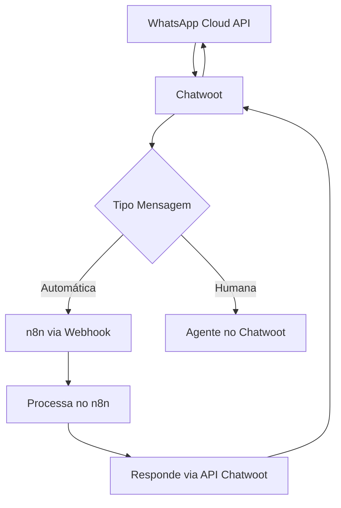

# 🔄 Integração Chatwoot + n8n + WhatsApp Cloud API

## 📱 Arquitetura Recomendada

```
WhatsApp Business API (Oficial)
        ↓
    Chatwoot (Hub Central)
        ↓
    Webhooks → n8n (Automações)
        ↓
    Resposta via Chatwoot API
```

## 1️⃣ Configurar WhatsApp Cloud API no Chatwoot

### No Meta Business:
1. Criar App no Meta for Developers
2. Adicionar WhatsApp Business API
3. Gerar Token de Acesso Permanente
4. Obter Phone Number ID

### No Chatwoot:
```ruby
# Criar canal WhatsApp via Rails Console
channel = Channel::Whatsapp.create!(
  account_id: 1,
  phone_number: '+5511999999999',
  provider: 'whatsapp_cloud',
  provider_config: {
    api_key: 'SEU_ACCESS_TOKEN',
    phone_number_id: 'SEU_PHONE_NUMBER_ID',
    business_account_id: 'SEU_BUSINESS_ID'
  }
)
```

## 2️⃣ Configurar Webhooks para n8n

### A. Webhook de Mensagens Recebidas
```ruby
# No Chatwoot - criar webhook
webhook = account.webhooks.create!(
  url: 'https://seu-n8n.com/webhook/chatwoot-messages',
  webhook_type: 'message_created',
  subscriptions: ['message_created', 'message_updated']
)
```

### B. Estrutura do Payload para n8n
```json
{
  "event": "message_created",
  "id": "1",
  "content": "Mensagem do cliente",
  "created_at": "2024-01-01T10:00:00Z",
  "message_type": "incoming",
  "content_type": "text",
  "conversation": {
    "id": 1,
    "status": "open",
    "contact": {
      "id": 1,
      "name": "João Silva",
      "phone_number": "+5511999999999"
    }
  },
  "sender": {
    "id": 1,
    "name": "João Silva",
    "type": "contact"
  }
}
```

## 3️⃣ Fluxo n8n Recomendado

### Workflow Exemplo:
```javascript
// 1. Webhook Node - Recebe do Chatwoot
{
  "webhookMethod": "POST",
  "path": "chatwoot-messages"
}

// 2. Filter Node - Apenas mensagens de clientes
if (items[0].json.message_type === 'incoming') {
  // Processar mensagem
}

// 3. Sua Lógica de Negócio
// - Verificar contexto
// - Buscar dados no CRM
// - Gerar resposta com IA
// - etc.

// 4. HTTP Request Node - Responder via Chatwoot API
{
  "method": "POST",
  "url": "http://localhost:3000/api/v1/accounts/1/conversations/{{conversationId}}/messages",
  "authentication": "apiKey",
  "headers": {
    "api_access_token": "SEU_TOKEN_CHATWOOT"
  },
  "body": {
    "content": "Resposta automatizada",
    "message_type": "outgoing",
    "private": false
  }
}
```

## 4️⃣ Melhores Práticas

### A. Usar Agent Bot no Chatwoot
```ruby
# Criar bot dedicado para n8n
bot = AgentBot.create!(
  account_id: 1,
  name: 'n8n Bot',
  outgoing_url: 'https://seu-n8n.com/webhook/bot',
  bot_type: 'webhook'
)

# Associar ao inbox
inbox.agent_bot_inbox = bot
inbox.save!
```

### B. Controle de Handover
```javascript
// No n8n - Transferir para humano quando necessário
if (needsHumanAgent) {
  // Chatwoot API - Atualizar conversa
  await chatwootApi.post(`/conversations/${conversationId}/toggle_status`, {
    status: 'open'
  });
  
  // Adicionar label
  await chatwootApi.post(`/conversations/${conversationId}/labels`, {
    labels: ['precisa-agente-humano']
  });
}
```

### C. Usar Custom Attributes
```javascript
// Salvar contexto no Chatwoot
await chatwootApi.patch(`/contacts/${contactId}`, {
  custom_attributes: {
    ultima_interacao_bot: new Date(),
    score_satisfacao: 8,
    tipo_cliente: 'premium'
  }
});
```

## 5️⃣ Fluxo Híbrido Recomendado



## 6️⃣ Vantagens desta Arquitetura

✅ **Chatwoot como Hub Central**
- Histórico completo das conversas
- Interface unificada para agentes
- Relatórios e métricas
- Multi-canal (não só WhatsApp)

✅ **n8n para Automações**
- Lógica complexa sem código
- Integrações ilimitadas
- Fácil manutenção
- Debug visual

✅ **WhatsApp Cloud API**
- Oficial e confiável
- Sem risco de banimento
- Recursos avançados (botões, listas, etc)
- Verificação de empresa

## 7️⃣ Configuração de Webhooks Bidirecionais

### No Chatwoot:
```ruby
# Webhook para n8n
Webhook.create!(
  account_id: 1,
  url: 'https://n8n.exemplo.com/webhook/chatwoot',
  subscriptions: [
    'conversation_created',
    'conversation_status_changed', 
    'message_created',
    'contact_created',
    'contact_updated'
  ]
)
```

### No n8n - Webhook de Resposta:
```javascript
// Receber atualizações do Chatwoot
const webhook = $input.all();

// Filtrar apenas mensagens importantes
if (webhook[0].json.event === 'message_created' && 
    webhook[0].json.message_type === 'incoming') {
  
  // Sua lógica aqui
  const response = await processMessage(webhook[0].json);
  
  // Responder via API
  await chatwootApi.sendMessage(response);
}
```

## 8️⃣ Autenticação Segura

### Gerar Token no Chatwoot:
```ruby
# Rails console
user = User.find_by(email: 'bot@exemplo.com')
token = user.access_token.token
puts "Token para n8n: #{token}"
```

### Usar no n8n:
```javascript
{
  headers: {
    'api_access_token': '{{$env.CHATWOOT_TOKEN}}'
  }
}
```

## 9️⃣ Monitoramento e Logs

### Dashboard de Métricas:
- Taxa de resolução automática
- Tempo médio de resposta
- Satisfação do cliente
- Handover rate para humanos

### Logs Estruturados:
```javascript
// No n8n
console.log({
  timestamp: new Date(),
  conversationId: data.conversation.id,
  action: 'bot_response',
  success: true,
  responseTime: executionTime
});
```

## 🚀 Próximos Passos

1. **Configurar WhatsApp Cloud API** no Meta Business
2. **Criar Webhook** no Chatwoot apontando para n8n
3. **Desenvolver fluxo** no n8n com sua lógica
4. **Testar integração** end-to-end
5. **Monitorar métricas** e ajustar

Esta arquitetura permite total flexibilidade mantendo o Chatwoot como sistema de registro central!